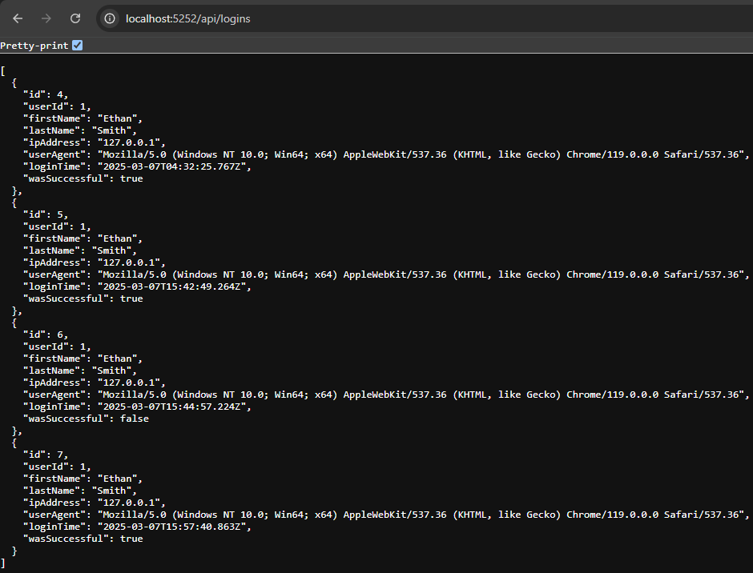

# Login Monitor API
### A simple API to monitor user logins
Just a practice API to get reacquainted with .NET Core and Entity Framework Core.

#### Example POST Request
```json
{
  "userId": 1,
  "firstName": "John",
  "lastName": "Doe",
  "ipAddress": "127.0.0.1",
  "userAgent": "Mozilla/5.0 (Windows NT 10.0; Win64; x64) AppleWebKit/537.36 (KHTML, like Gecko) Chrome/119.0.0.0 Safari/537.36",
  "loginTime": "2025-03-07T04:32:25.767Z",
  "wasSuccessful": true
}
```

#### appsettings.json
I simply used a UUID generator for the API keys, but you can use whatever you want.
This is example details for a PostgreSQL database. Never add real database details and API keys
to a Git repository.
```json
{
  "ConnectionStrings": {
    "DefaultConnection": "Host=localhost;Port=5432;Database=LoginMonitorDB;Username=postgres;Password=admin"
  },
  "ApiKeys": {
    "AdminKey": "9cdba766-b314-4284-9745-156de1f3b33a",
    "UserKey": "be469f44-b55a-4149-9ccb-eed48d1a8955"
  },
  "Logging": {
    "LogLevel": {
      "Default": "Information",
      "Microsoft.AspNetCore": "Warning"
    }
  },
  "AllowedHosts": "*"
}
```
#### Example of Get All Request
Note: You will need to set your request headers to pass the api key with key 'x-api-key'.
